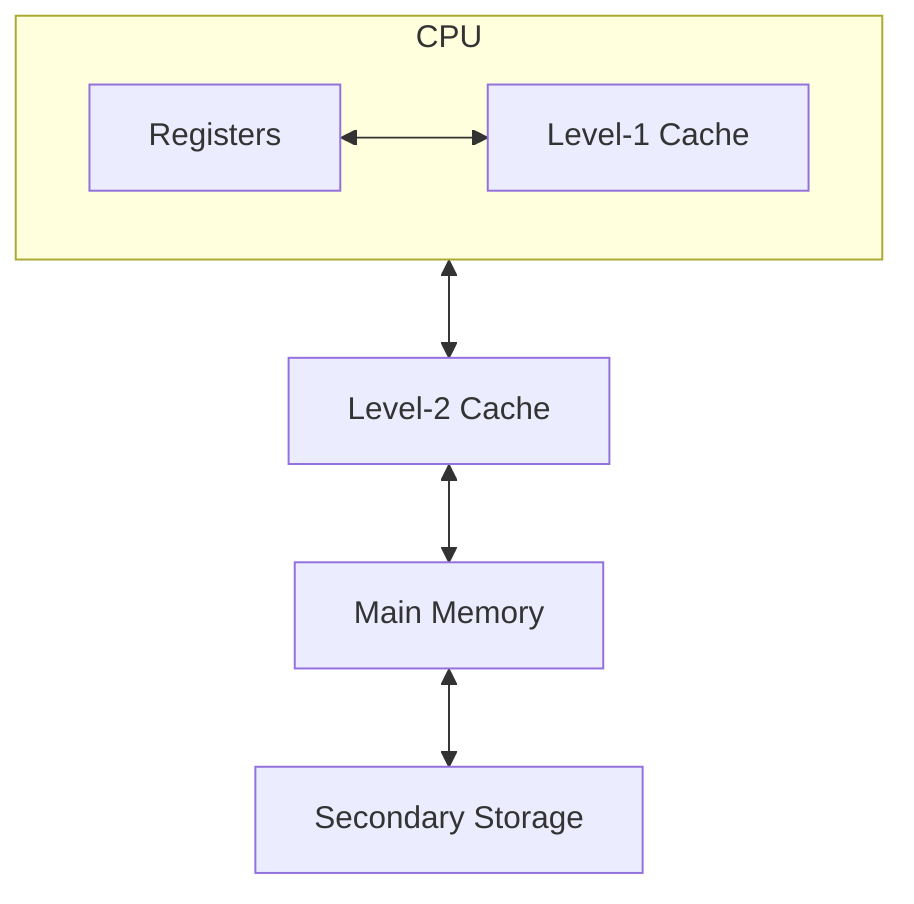
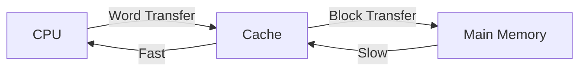
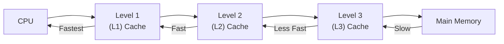
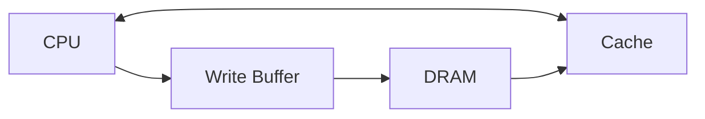
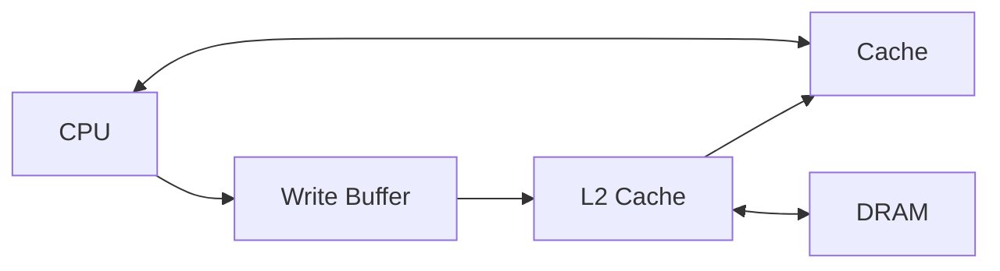

---
# prettier-ignore
date: 2026-01-06
title: Memory Organization
description: Note of memory organization.
weight: 14
---

## Memory Hierarchy



The capacity is increased from top to bottom, while the speed is increased from bottom to top.

## Main Memory

| Type   | Full Name                                           | Definition                                                                                                | Feature / Difference                         |
| ------ | --------------------------------------------------- | --------------------------------------------------------------------------------------------------------- | -------------------------------------------- |
| PROM   | Programmable Read Only Memory                       | A Read Only Memory (ROM) that can be modified only once by a user.                                        | Reprogrammable only once.                    |
| EPROM  | Erasable Programmable Read Only Memory              | A programmable ROM that can be erased and reused.                                                         | Can be reprogrammed using ultraviolet light. |
| EFPROM | Electrically Erasable Programmable Read Only Memory | A user-modifiable ROM that can be erased and reprogrammed repeatedly through a normal electrical voltage. | Can be reprogrammed using electrical charge. |

## Auxiliary Memory (Secondary Storage)

Auxiliary memory has the following features:

- Non-volatile memory
- Lowest-cost
- Highest-capacity
- Slowest-access storage

It includes two types:

- **Solid State Drive (SSD):** This can speed up the performance of a computer and is more expensive.
- **Hard Disk Drive (HDD):** This is cheaper and offers more storage.

## Associative Memory / Content-Addressable Memory (CAM)

Items are retrieved by matching some part of their content rather than by specifying their address.

It is much slower than RAM, and is rarely encountered in mainstream computer designs, but it is used in multilevel memory systems, where a small fast memory such as a cache may hold copies of some blocks of a larger memory for rapid access.

A search key/descriptor must be presented to retrieve a word from associative memory. And this key is compared in parallel with the corresponding lock or tag bits of all stored words, and all words matching this key are signaled to be available.

Features of associative memory:

- It is expensive to implement as integrated circuitry.
- It can use in certain very high speed searching applications.
- It searches data/tag for access by content rather than address.

## Cache Memory

### Single Cache



### Three-level Cache Organization



### Cache Organization

The main memory includes three parts:

```text
| Tag | Index | Offset |
 n - m    m        b
```

- **Tag:** Check whether hit happens.
- **Index:** Used to choose the location of cache.
- **Offset:** Offset inside the block.
- **Block (Cache Line):** The minimal unit of storing data in cache.

Main memory size: $N = 2^n$ blocks.

Cache size: $M = 2^m$ blocks.

#### Direct-mapped Cache

$$
\text{Cache Line} = \text{(Memory Block Number)} \mod \text{(Number of Cache Lines)}
$$

#### Full Associative Cache

This type of cache has no `Index`. The structure is:

```text
| Tag | Offset |
```

A memory block can be placed in any unused cache block to avoid conflict.

Since there is no index field in the address, the entire address must be used as the tag, which increases the total cache size. And data could be anywhere in the cache, so the tag of every cache block must be checked.

#### Set Associative Cache

The cache is divided into groups of blocks, called **sets**.

Each memory address maps to exactly one set in the cache, but data may be placed in any block within that set.

If each set has $2^x$ blocks, the cache is a $2^x$-way associative cache.

If a cache has $2^m$ sets and each block has $2^b$ bytes, the memory address can be partitioned as follows:

```text
Address (n + b bits) | Tag | Index | Offset |
                      n - m    m        b
```

$$
\begin{align*}
  \text{Block Offset} &= \text{Memory Address} \mod 2^b \\
  \text{Block Address} &= \text{Memory Address} \div 2^b \\
  \text{Set Index} &= \text{Block Address} \mod 2^m
\end{align*}
$$

There are some cache replacement algorithms:

1. **Least Recently Used (LRU):** Replace the cache line that has been in the cache the longest with no references to it.
2. **First-in First-out (FIFO):** Replace the cache line that has been in the cache the longest.
3. **Least Frequently Used (LFU):** Replace the cache line that has experienced the fewest references.
4. **Random:** Pick a line at random from the candidate lines.

Cache write policies are used if data is already in the cache:

- **No-Write:** Write invalidate the cache and go directly to memory.
- **Write-Through:** Write go to main memory and cache.
- **Write-Back:** CPU writes only to cache and cache writes to main memory later when block is evicted.

If data is not in the cache:

- **Write-Allocate:** Allocate a cache line for new data and maybe write-through.
- **No-Write-Allocate:** Ignore cache, just go to main memory.

A write buffer with FIFO algorithm is used to solving speed mismatch problem.



L1 cache writes L2 cache with Write-Through policy and L2 cache writes main memory with Write-Back policy.


